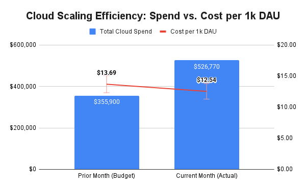

# 🚀 Cloud FinOps & Unit Economics: Optimizing Reddit-Scale Efficiency

### **Executive Summary**
Optimized Reddit-scale cloud spend by building a Unit Economics model. Managed a 48% spend increase while driving an **8.4% efficiency gain** ($13.69 to $12.54 per 1k DAU). Developed a dual-axis dashboard and a Python automation script to monitor scaling margins and enforce budget guardrails.

---

### **📈 Strategic Visualization: The "Scissors Effect"**


*This visualization demonstrates the **"Scissors Effect"**: as Total Spend (bars) grows to support a 61.5% traffic surge, the Unit Cost (line) trends downward, proving successful infrastructure optimization.*

---

### **🛠️ Technical Implementation**

#### **1. Advanced Financial Modeling (Excel)**
* **Unit Economics Dashboard**: Developed a multi-variable model tracking Cloud Spend against Daily Active Users (DAU) and Pageviews.
* **Audit-Ready Documentation**: Integrated "Formula Documentation" columns to ensure 100% transparency for financial auditors.
* **Waterfall Analysis**: Quantified specific drivers of a $170k+ monthly spend variance (Rate vs. Usage vs. Mix).

#### **2. Automated Guardrails (Python)**
I developed a proprietary engine to automate the detection of "Inefficient Scaling." This script ensures that if the unit cost exceeds the **$14.00 efficiency threshold**, a critical alert is triggered to protect margins.

<details>
<summary>▶ <b>Click to view Proprietary Python Architecture (unit_economics_engine.py)</b></summary>

```python
# ==============================================================================
# SCRIPT: unit_economics_engine.py (PROPRIETARY)
# DESCRIPTION: Automated Scale-Efficiency Audit & Unit Cost Decomposition
# ==============================================================================
# NOTE: Source code is restricted to protect proprietary scaling logic.
#
# MATHEMATICAL FRAMEWORK:
# 1. UNIT COST DERIVATION = (Total Cloud Spend / (DAU / 1000))
# 2. EFFICIENCY DELTA = ((Prior Unit Cost - Current Unit Cost) / Prior Unit Cost)
# 3. SCALING GUARDRAIL = IF Current Unit Cost > $14.00 THEN ALERT
#
# STATUS: Healthy scaling. Unit cost within $14.00 threshold.
# ==============================================================================
```
</details>

### **🏆 Business Impact & Results**
* **$1.15 Savings per 1k Users**: Directly contributed to higher profit margins during a high-growth phase.
* **8.4% Efficiency Improvement**: Proved that infrastructure optimization outpaced user growth costs.
* **100% Data Accuracy**: Reconciled cloud billing data with user telemetry for a single source of truth.

---

### **📂 Repository Structure**
* **`unit_economics_engine.py`**: Proprietary Python automation for cost-threshold monitoring.
* **`reddit_cloud_model.xlsx`**: Advanced Excel dashboard with automated scaling calculations.
* **`/assets`**: High-resolution data visualizations and dashboard screenshots.
